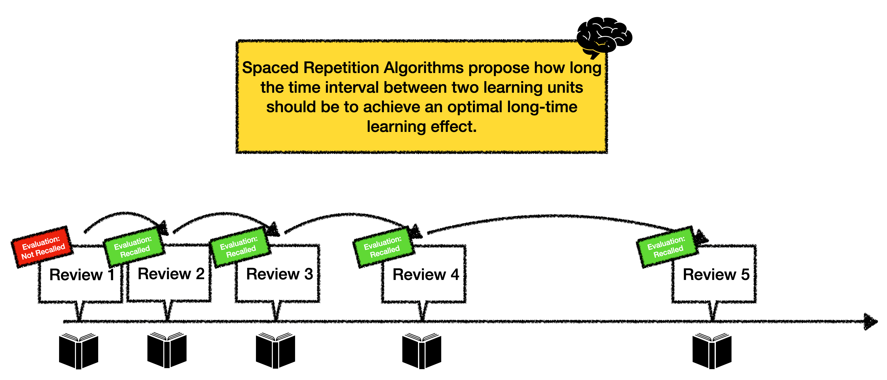

# Spaced Repetition Algorithms for Swift

## What is Spaced Repetition?

Spaced Repetition is a learning method. The method is based on repeating/reviewing a learning unit (usually a flashcard) at certain time intervals to consolidate it in the long-term memory. The brain can better remember content that is repeated over a long period of time.

**Terms**
- Learning Unit: Something that should be learned (often a flashcard)
- Review: The act of „learning“ a unit
- Evaluation: Information about the review (for example: difficulty or lateness)

Tipp - The following webpage provides an interactive webcomic about spaced repetition: https://ncase.me/remember/

## How do Spaced Repetition Algorithms work?



Spaced repetition algorithms are often used in flashcard apps. The algorithms calculate how long the optimal time interval between two reviews for a learning unit should be. The calculation is based on the user's feedback on how easy or difficult the last review was perceived. Normally, the time interval increases the more often a learning unit has been successfully recalled. Frequent repetitions cause the memory curve to decrease slower. If a learning content cannot be recalled, the time intervals between reviews will become shorter again.


## How to use this package

The algorithms in this package are all structured in the same way. The information about the last "Review" and the current "Evaluation" is taken as input. As an output, the algorithm returns the next „Review“ containing the duration of the interval.

Here is how you can use the algorithms:

First, the user has to „review“ the information / flashcard. Based on the performance of the user, an `evaulation`-object can be created:

```swift
let firstUserScore = Score.recalled_easily //how well did the user recall the information during the last review?
let firstEvaluation = Evaluation(score: firstUserScore)
```

Next, we can decide which algorithm to use to calculate the proposed time-interval for the next review-session:

```swift
let spacedRepetitionAlgorithm = AnkiLikeAlgorithm() //choose between different algorithms, see below
```

Using the information from the evaluation, the interval can be calculated:

```swift
let firstReview = spacedRepetitionAlgorithm.nextReview(currentEvaluation: firstEvaluation)
print(firstReview.intervalDays) //prints "4"
```

An interval of „4“ means the algorithm proposes that the same learning unit should be reviewed again in 4 days.

Imagine, that the actual review happens after 5 days. Let’s calculate how long the next interval should be:

```swift
let lateness = 1.0 //how many days was the learning unit reviewed "too late" (compared to the last proposed interval). For example: If the algorithm proposes that the information is reviewed again in 4 days after the last review but the actual review happens 5 days after the last review, the lateness is 1. A negative lateness-value means the the information was reviewed too early. For example, choose a lateness of -2 if the learning unit was reviewed 2 days after the last review instead of 4 days.
let secondUserScore = Score.not_recalled //ooops... let's say the user did not recall the learning unit
let secondEvaluation = Evaluation(score: secondUserScore, lateness: lateness) 
let secondReview = spacedRepetitionAlgorithm.nextReview(lastReview: firstReview, currentEvaluation: secondEvaluation)

print(secondReview.intervalDays) //prints "0.000694" (= 1 minute)
```

Note that many algorithms internally use an ease-factor to rate the difficulty of a learning unit:

```swift
print(secondReview.easeFactor) //usually between 1 and 2.5
```

An ease factor of 2.5 means that a learning unit is considered easy, while an ease factor of 1.3 or lower means that a learning unit is considered to be very hard to recall.

## Which Spaced Repetition Algorithms are included in this Package?

### SuperMemo2 Algorithm

This is one of the most well-known spaced repetition algorithms. The lateness of a review is not considered for this algorithm. 

```swift
let spacedRepetitionAlgorithm = AnkiLikeAlgorithm()
let Review nextReview = spacedRepetitionAlgorithm.nextReview(lastReview: review, currentEvaluation: evaluation)
```

Learn more about this algorithm here: [https://www.supermemo.com/en/archives1990-2015/english/ol/sm2](https://www.supermemo.com/en/archives1990-2015/english/ol/sm2)

### Leitner System Algorithm

The Leitner System is a straightforward spaced repetition system from 1970. This system is often used with physical flashcards. It requires several boxes to put the cards in. Cards in the first box are repeated every day, cards in the second box are repeated every 3 days, cards in the third box are repeated every 5 days and so on. If a card is recalled correctly during a review, it is promoted to the next box. If a card is not recalled during the review, it is moved back to the previous box. The lateness of a review is not considered for this algorithm. 

```swift
let spacedRepetitionAlgorithm = LeitnerSystem()
let Review nextReview = spacedRepetitionAlgorithm.nextReview(lastReview: review, currentEvaluation: evaluation)
```

Learn more about this algorithm here: [https://en.wikipedia.org/wiki/Leitner\_system](https://en.wikipedia.org/wiki/Leitner_system)

### Anki-Like Algorithm

Anki is a very popular flashcard application. The Anki-Like Algorithm works similar to the algorithm used in Anki. Based on the user’s evaluation, the algorithm assumes a „difficulty“ for each learning unit and changes the interval between two reviews accordingly. Furthermore, a bit of randomness is included to prevent that multiple flashcards get bunched together.

```swift
let spacedRepetitionAlgorithm = AnkiLikeAlgorithm()
let Review nextReview = spacedRepetitionAlgorithm.nextReview(lastReview: review, currentEvaluation: evaluation)
```

### Fresh Cards Algorithm

This algorithm is used for the app „Fresh Cards“. It works similar like the Anki- and the SuperMemo2-algorithms. In addition, the lateness or earliness of a review is considered during the calculation of the next interval. The algorithm considers that it is easier to recall a learning unit if it is reviewed too early and more difficult if it is reviewed too late.

Again, a bit of randomness is included to prevent that multiple flashcards get bunched together.


```swift
let spacedRepetitionAlgorithm = FreshCards()
let Review nextReview = spacedRepetitionAlgorithm.nextReview(lastReview: review, currentEvaluation: evaluation)
```


### Due-Regularly Algorithm

This is the simplest algorithm. Reviews follow a fixed time-interval that can be configured (for example, one review every 2 days). It is not relevant whether the information was recalled or not during the last review and how early or late a review was.

```swift
let spacedRepetitionAlgorithm = DueRegularly(dueInterval: 2)
let Review nextReview = spacedRepetitionAlgorithm.nextReview(lastReview: review, currentEvaluation: evaluation)
```

## Learn more about Spaced Repetition

The following page contains interesting information and more details about Spaced Repetition: [https://www.freshcardsapp.com/srs/write-your-own-algorithm.html](https://www.freshcardsapp.com/srs/write-your-own-algorithm.html)
